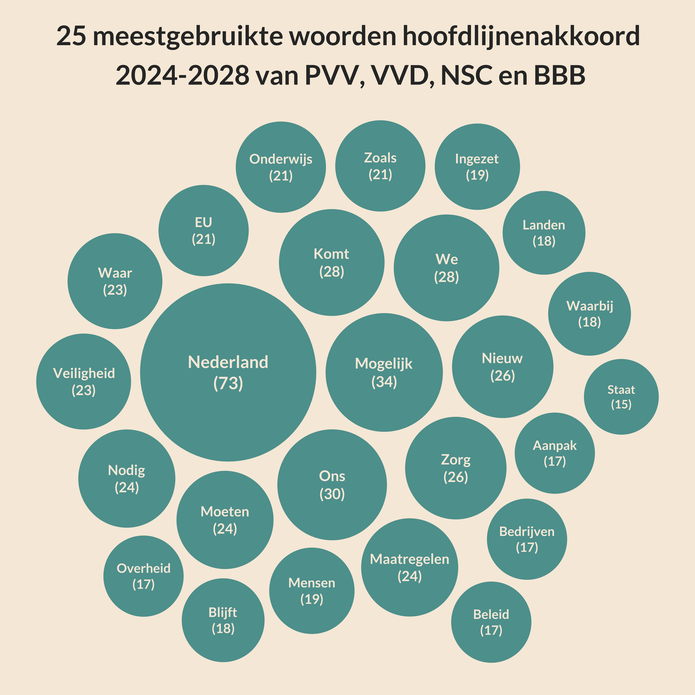
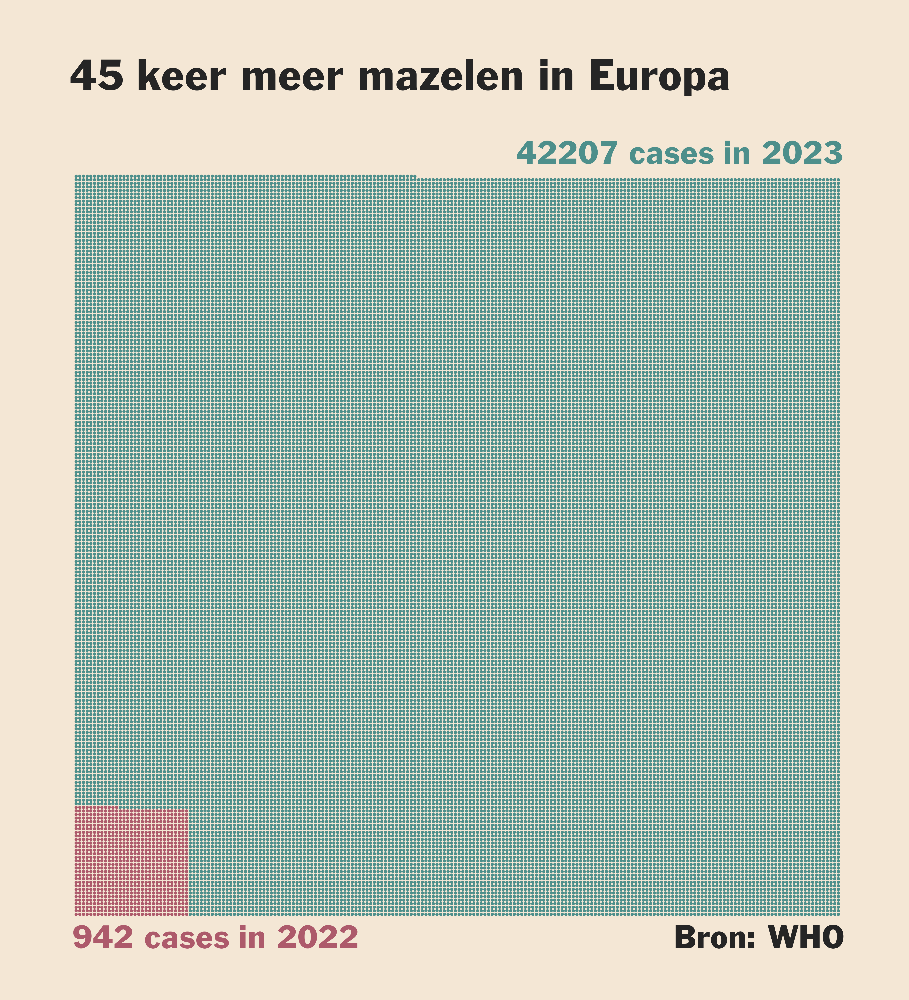

Click on header for the code or on the visualization for the folder
containing the data, code and visualization.

## [Mei 2024: Hoofdlijnenakkoord](https://github.com/Willem-Jelle/Visualizations/blob/main/2024-05_hoofdlijnenakkoord/2024-05_hoofdlijnenakkoord_code.R)

## [April 2024: Broedvogels in Nederland](https://github.com/Willem-Jelle/Visualizations/blob/main/2024-04_broedvogels/2024-04_broedvogels_code.R)

## [March 2024: Cherry Tree Blossom](https://github.com/Willem-Jelle/Visualizations/blob/main/2024-03_cherry_tree_blossom/2024-03_cherry_tree_blossom_code.R)

## [February 2024: Measels Outbreak](https://github.com/Willem-Jelle/Visualizations/blob/main/2024-02_measels_outbreak/2024-02_measels_outbreak_code.R)

