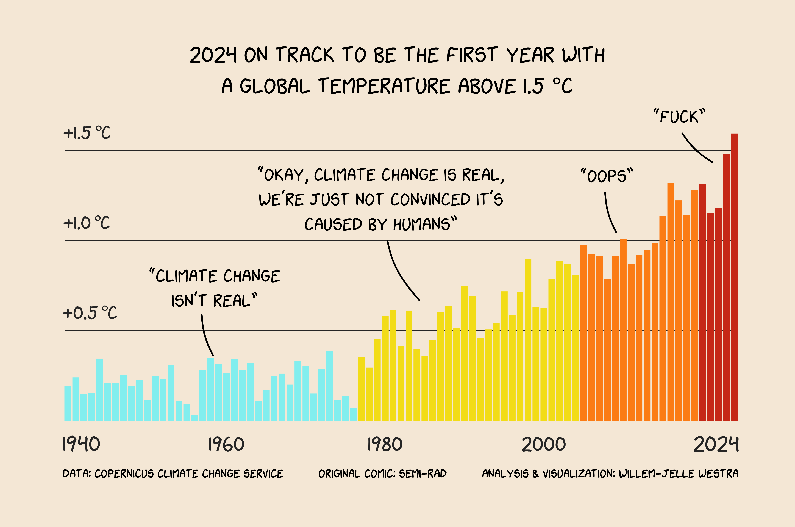
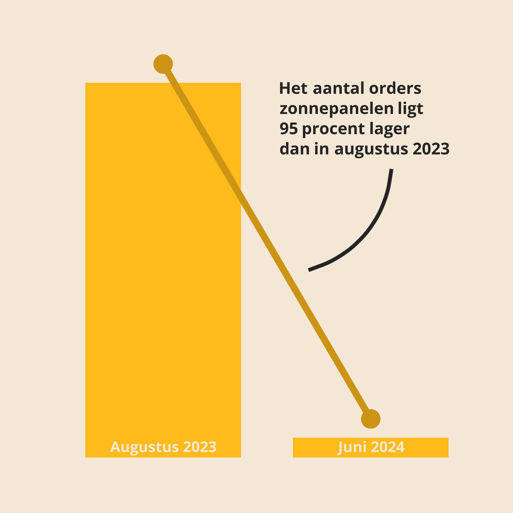
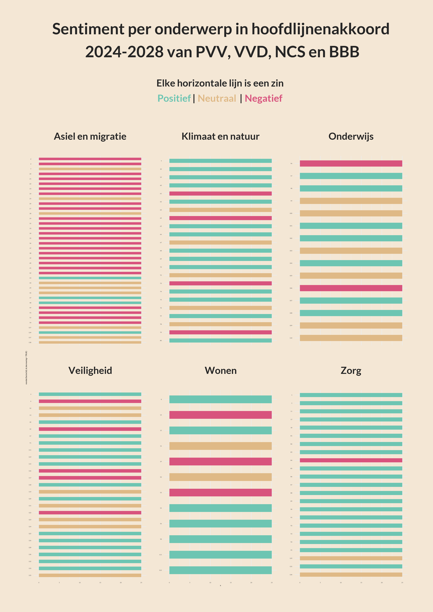

Click on header for the code or on the visualization for the folder
containing the data, code and visualization.

## [November 2024: Warmest year](https://github.com/Willem-Jelle/Visualizations/blob/main/2024-11_warmest_year/2024-11_warmest_year_code.R)

## [Oktober 2024: Netflix - Wat doe jij met je tijd?](https://github.com/Willem-Jelle/Visualizations/blob/main/2024-10_netflix/2023-10_netflix_code.R)

## [Juli 2024: Remaking warming stripes](https://github.com/Willem-Jelle/Visualizations/blob/main/2024-07_remaking_warming_stripes/2024-07_remaking_warming_stripes_code.R)

## [Juni 2024: Orders zonnepanelen](https://github.com/Willem-Jelle/Visualizations/blob/main/2024-06_orders_zonnepanelen/2024-06_orders_zonnepanelen_code.R)

## [Mei 2024: Hoofdlijnenakkoord #2](https://github.com/Willem-Jelle/Visualizations/blob/main/2024-05_sentiment_hoofdlijnenakkoord/2024-05_sentiment_hoofdlijnenakkoord_code.R)

## [Mei 2024: Hoofdlijnenakkoord #1](https://github.com/Willem-Jelle/Visualizations/blob/main/2024-05_hoofdlijnenakkoord/2024-05_hoofdlijnenakkoord_code.R)

## [April 2024: Broedvogels in Nederland](https://github.com/Willem-Jelle/Visualizations/blob/main/2024-04_broedvogels/2024-04_broedvogels_code.R)

## [March 2024: Cherry Tree Blossom](https://github.com/Willem-Jelle/Visualizations/blob/main/2024-03_cherry_tree_blossom/2024-03_cherry_tree_blossom_code.R)

## [February 2024: Measels Outbreak](https://github.com/Willem-Jelle/Visualizations/blob/main/2024-02_measels_outbreak/2024-02_measels_outbreak_code.R)

